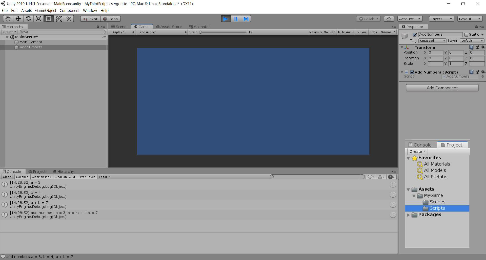

# MyThirdScript-cs-vgoette

### Project Description: 

The aim of this project is twofold: 
+ First, it serves practicing the git/GitHub workflow, including writing a meaningful REAMDE 
+ Second, this is the first time using a debug message with concatinations of strings and variables 

### Development Platform: 

Windows 10, Unity version 2019.1.14f1, Visual Studio Code 2019

### Target Platform: 

WebGL (RefRes: 1280x720 HD-720p)  

### Screenshots:

### Lessons Learned:

+ Basic Practice with unity project on GitHub, coding Debug message 
+ How to add Screenshots in VisualStudio

 